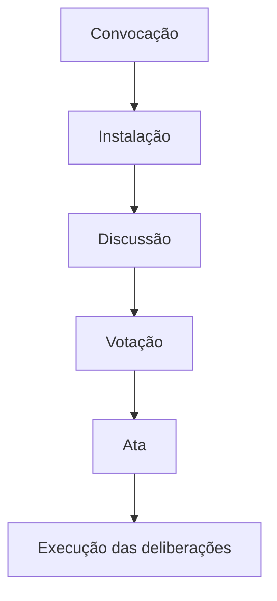

# Manual do Síndico Profissional

# Volume I – Fundamentos do Condomínio

# Capítulo 5 – Assembleias Condominiais

**Versão:** 2.0  
**Nível:** Fundamental (Padrão Definitivo)  
**Tempo estimado de estudo:** 4 horas

---

# Objetivos de aprendizagem

Ao final deste capítulo, o leitor será capaz de:

- compreender a função da assembleia na governança condominial;
- diferenciar assembleias ordinárias e extraordinárias;
- interpretar regras de convocação, instalação e deliberação;
- identificar a importância dos quóruns legais;
- reconhecer o papel do síndico, do presidente da mesa e do secretário.

---

# Introdução

A assembleia é o principal órgão deliberativo do condomínio. É nela que os condôminos exercem a gestão coletiva do patrimônio comum, aprovando contas, elegendo representantes, autorizando despesas e definindo diretrizes para a administração.

Um processo assemblear conduzido de forma inadequada pode tornar decisões inválidas, gerar litígios e comprometer a legitimidade da gestão.

---

# 1. Natureza jurídica da assembleia

A assembleia representa a manifestação formal da vontade coletiva dos condôminos.

Ela não substitui a lei, nem a convenção condominial, mas delibera dentro dos limites estabelecidos por ambas.

As decisões regularmente aprovadas obrigam todos os condôminos, inclusive os ausentes e, em determinadas hipóteses, os dissidentes.

---

# 2. Espécies de assembleia

## Assembleia Ordinária

Realizada periodicamente, normalmente uma vez por ano.

Entre suas atribuições mais comuns:

- prestação de contas;
- aprovação do orçamento;
- eleição de síndico e conselhos, quando aplicável;
- definição das contribuições condominiais.

## Assembleia Extraordinária

Convocada sempre que surgir assunto relevante que não possa aguardar a próxima assembleia ordinária.

Exemplos:

- obras urgentes;
- alterações relevantes na administração;
- destituição do síndico;
- aprovação de despesas extraordinárias.

---

# 3. Convocação

A convocação deve observar rigorosamente:

- convenção condominial;
- Código Civil;
- prazo mínimo previsto;
- forma de comunicação estabelecida pelo condomínio.

A pauta deve ser clara, objetiva e suficiente para permitir que os condôminos compreendam previamente os assuntos que serão deliberados.

---

# 4. Quóruns

Nem toda decisão depende da mesma quantidade de votos.

Algumas matérias exigem maioria simples.

Outras dependem de quóruns qualificados previstos na legislação, especialmente para:

- alteração da convenção;
- determinadas obras;
- destituição do síndico;
- mudanças de destinação da edificação.

O síndico deve conhecer esses quóruns antes da convocação.

---

# 5. Condução da assembleia

Uma assembleia eficiente costuma seguir a seguinte sequência:

1. verificação de quórum;
2. eleição do presidente da mesa;
3. eleição do secretário;
4. leitura da pauta;
5. debates;
6. votação;
7. lavratura da ata.

O presidente organiza os trabalhos.

O secretário registra fielmente os acontecimentos e deliberações.

---

# Fluxo simplificado

---

# Papel do síndico

Compete ao síndico:

- convocar assembleias quando exigido;
- fornecer informações aos condôminos;
- executar as decisões regularmente aprovadas;
- preservar a regularidade do procedimento.

---

# Erros comuns

- convocação incompleta;
- inclusão de assuntos não previstos na pauta;
- desrespeito aos quóruns legais;
- atas imprecisas;
- execução de deliberações manifestamente ilegais.

---

# Estudo de caso

Durante uma assembleia convocada exclusivamente para aprovação das contas anuais, um grupo de condôminos propõe e aprova, por maioria simples, a construção de uma nova área gourmet.

Analise:

- a matéria poderia ser deliberada?
- a pauta foi respeitada?
- qual quórum poderia ser necessário?
- quais riscos jurídicos decorrem dessa deliberação?

---

# Checklist

Antes da assembleia:

- [ ] pauta definida;
- [ ] convocação regular;
- [ ] documentos disponíveis;
- [ ] verificação dos quóruns aplicáveis.

Após a assembleia:

- [ ] ata elaborada;
- [ ] deliberações comunicadas;
- [ ] providências administrativas iniciadas.

---

# Como um excelente síndico pensa

A assembleia não deve ser vista como um obstáculo administrativo, mas como o principal mecanismo de legitimidade das decisões condominiais.

Quanto maior a transparência e a preparação da reunião, menor a probabilidade de conflitos futuros.

---

# Exercícios

1. Diferencie assembleia ordinária e extraordinária.
2. Explique por que a pauta possui importância jurídica.
3. Qual a função do presidente da mesa?
4. Em que situações os quóruns qualificados são relevantes?

---

# Glossário

**Assembleia Ordinária**  
Reunião periódica destinada às deliberações regulares do condomínio.

**Assembleia Extraordinária**  
Reunião convocada para assuntos específicos e urgentes.

**Quórum**  
Quantidade mínima de votos exigida para determinada deliberação.

**Ata**  
Documento que registra oficialmente os acontecimentos e decisões da assembleia.

---

# Referências comentadas

## Legislação

- Código Civil (Lei nº 10.406/2002), arts. 1.348 a 1.355.
- Lei nº 4.591/1964 (dispositivos vigentes).

## Doutrina

- Caio Mário da Silva Pereira. *Condomínio e Incorporações*.
- Flávio Tartuce. *Manual de Direito Civil*.
- Carlos Roberto Gonçalves. *Direito Civil Brasileiro – Direito das Coisas*.

## Leitura complementar

Recomenda-se a leitura integral dos dispositivos do Código Civil relativos às assembleias e aos quóruns deliberativos antes do estudo do próximo capítulo.
